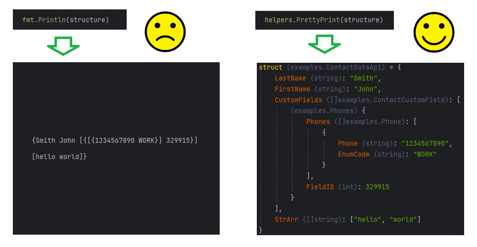

# helpers

Provides convenient printing and pretty-printing of structures, slices, maps, arrays, and JSON for Go, as well as additional helper functions for development.



## Installation


```bash
go get github.com/evkalm/helpers
```